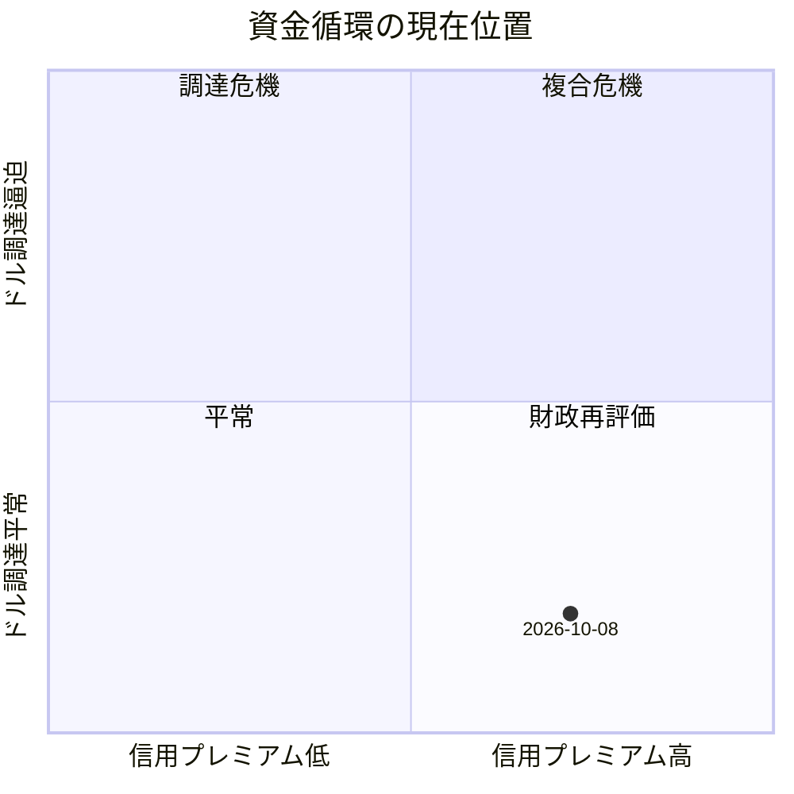

基準日は2026年10月8日です。原油、ドル調達、欧州国債、金の観測値を一次資料と市場報道から分けて集め、仮説は後から判定します。

基準日は2026年10月8日（JST）です。数値はソース間で日中値がずれているため、観測日と出典を分けて置きます。仮説は事実として扱っていません。

## 第1部：調査結果の概要

最も重要な発見は、三つのストレスが同じ段階にないことです。原油はイラン戦争とホルムズ攻撃で2月の約72ドルから100ドル超へ上がっています。フランス国債は対独スプレッドが約140bpまで広がり、2012年以来の水準です。一方、ドル資金調達の逼迫は、クロスカレンシー・ベーシスとFRBスワップ利用からは確認できません。金は1月29日の高値5,405ドルから約4,150ドル前後まで下落していますが、9月の金ETFは価格下落のなかでも流入しており、換金売りの証拠にはなりません。

当初仮説からの修正は次の三点です。第一に、原油のドル建て決済だけではドル高を説明できません。ドル指数は102台で2026年の高値圏ですが、上昇幅は原油の約46%上昇より小さく、実質金利と長短金利の方が整合的です。第二に、フランス国債の利回り上昇はフランス固有の財政・政治プレミアムが中心で、欧州銀行のドル調達危機までは落ちていません。第三に、二つのドル需要が重なって信用収縮を増幅している、というH3は現時点では支持されません。

未確認は、10月8日当日のEUR/USDベーシスの一次値、欧州銀行のフランス国債保有の最新内訳、金先物のCFTC建玉、円建て金の公式値、FRBスワップの10月当週利用です。有料端末の断面は推測していません。

## 第2部：原油とドル需要

事実として、米国とイスラエルによる対イラン攻撃は2026年2月28日に始まり、戦争は8カ月目です。10月7–8日もカタール沖タンカー攻撃と、イラン側による「ホルムズは閉鎖されている」という主張が報じられています。米国側は流出が戦前近くまで戻ったと述べ、Kplerの暫定値では9月30日時点の湾岸原油輸出7日移動平均が1,830万バレル/日とされます。イラン産原油そのものは7月14日以降の封鎖で中国向け通過が止まり、8月の積出は約22–25.5万バレル/日まで落ちた、という9月1日のロイター報道があります。流量の定義が異なり、全面途絶と回復が併存しています。

価格は、10月8日にBrentが約104–105ドル、WTIが約92–93ドルです。CNBCはBrent 105.30ドル（+5.13%）、WTI 92.78ドルと伝えています。2月の戦前水準約72ドル比ではおよそ46%高です。4月30日には126.41ドルまで上げ、5月下旬以降は100ドルを挟む展開でした。Brent–WTI格差は約12ドルで、海上・中東リスクがWTIよりBrentに乗っていることと整合します。在庫は8カ月の供給障害でバッファが減った、という市場報道はありますが、IEA公式の当日在庫は未確認です。運賃上昇は複数報道が指摘しています。

ドル需要の四分類は次のとおりです。

A（決済需要）は、輸入単価上昇で輸入国のドル支払いが増える経路としては成立し得ます。ただし輸出国へのドル移転と相殺し、DXYを一方向に動かす純効果は未確認です。イラン産のドル収入はむしろ止まっています。

B（インフレ経由の金利）は、部分的に支持されます。米国10年実質利回りは10月6日に2.91%です。名目10年は報道上5.25–5.34%近辺、ブレークイーブンは約2.3%台で、原油高が期待インフレを爆発させている形ではありません。実質金利の上昇は期待インフレよりタームプレミアムと政策金利高止まりの色が濃いです。

C（地政学の安全需要）は、戦争初期にはドル買いと整合します。4月の報道では攻撃開始後にベーシスがドル側へ振れ、その後の停戦期待で後退したとされます。10月の再燃ではDXYは高いものの、調達逼迫の再発は確認できません。

D（別要因）が残ります。FRBは9月16日に政策金利を3.75–4.00%へ25bp上げ、インフレは高止まりとしています。ドル高は金利差と米国成長の相対評価でも説明できます。

判定は、原油高がドル高の一因にはなり得るが、決済需要を主因とはできない、です。

## 第3部：欧州国債と信用不安

10月8日、フランス10年は約4.91%、ドイツ10年は約3.50%、格差は約140–142bpです。週内には約160bpまで開き、ドイツ統一後のブルームバーグデータで最大、というDeutsche Bankの指摘が報じられています。2012年のユーロ危機以来の水準です。9月18日時点では105bpが14年ぶりに100bpを超えた地点でした。

財政の事実は、2026年赤字見通しが5.4%程度、2025年5.1%、2024年5.8%です。政府は2027年度に約540億ユーロの歳出削減を掲げ、11月17日に採決の見通しです。債務は約3.5兆ユーロ、対GDPは約119%と報じられています。首相は少数与党で、2024年以降に政権が不信任で倒れ、2027年春の大統領選が間近です。本人見解として、財務相はスプレッド拡大を予算問題と結びつけています。

四分類では、B（フランス固有）が最もよく当てはまります。A（世界的な金利上昇）も同時にあり、米国10年が5%超であるなか独仏とも利回りは上がっています。ただしフランスの超過分は独国対比で約80bpから140bpへ拡大しており、共通要因だけでは説明できません。C（欧州全体への信用不安）は、イタリアやスペインよりフランスの対独格差が大きい、という記述はありますが、周縁国への伝染を示す銀行間市場の数値は未確認です。D（金融機関の調達難）は、国債利回りだけでは判定できません。CDSや欧州銀行のドルCP発行の一次データは今回取得できていません。

判定は、財政・政治の再評価としては明確、金融システム危機の開始としては未成立、です。

## 第4部：ドル高とドル調達難

ドル高は確認できます。DXYは10月8日朝時点で約102.43、前日102.24です。9月中旬の99前後から上昇し、2026年の高値圏です。EUR/USDは約1.119、USD/JPYは約158.2です。これは金利差とリスク回避の両方と整合しますが、水準自体は1985年や2022年のピークより低いです。

ドル調達難は確認できません。中央銀行流動性スワップは9月30日時点で2.07億ドルです。2008年や2020年3月の数千億ドル規模とは桁が違います。FIMAレポは9月30日時点で0ドルです。EUR/USDベーシスは、5月時点で3カ月物がおよそ−16〜−20bp、4月10日の報道では停戦期待でドル需要が後退、10月8日付の市場コメントでは「実質ゼロ」とされています。一次の当日プリントは未確認ですが、−50bpを超える急性ストレスを示す公開情報はありません。

ベーシスの読み方は、被覆金利平価に対する上乗せです。符号がより負になるほど、ドル以外の通貨を持つ主体がドルをスワップで調達するコストが現金市場より高く、ドルの希少性を示します。ゼロ近傍は、その上乗せが消えている状態です。ドル指数の上昇とは独立です。

必須判定は次のとおりです。ドル高は確認できる。ドル調達難は確認できない。両者を結びつける証拠は不足している。不足しているのは、10月8日のベーシス、FRA-OIS、欧州銀行のドルCP、スワップライン利用の当週値です。ドルの総量と、特定主体がその日に調達できるかは別問題で、後者の悪化は出ていません。

## 第5部：金価格の変動要因

スポットは10月8日に約4,144〜4,210ドルの範囲で報じられています。1月29日のLBMA午後値5,405ドルからは約23%安です。7月16日には3,993ドルまで下げた後、9月26日には4,286ドルでした。円建て公式値は未確認です。ドル高が円建てを下支えする方向ですが、USD/JPY 158では円安効果がドル建て下落を相殺する程度は、当日の国内価格がないため計算しません。

要因の比較です。A（実質金利）が最も整合します。10年TIPSは10月6日2.91%で、9月初旬の約2.46%から約50bp上昇し、2008年以来の高水準です。金はクーポンがないため、機会費用の上昇は下落圧力になります。B（ドル高）は同時に効いていますが、DXYの上昇幅は金の下落幅より小さく、主因とは断定できません。C（換金売り）は、株と金の同時安だけでは証拠になりません。D（ETF流出）は逆で、9月は価格が約7%下がるなか金ETFが70トン超流入した、という市場集計があります。E（先物解消）はCFTC未確認です。Fとして、中央銀行買いと財政不安が下値を支えている、という説明が複数の市場ノートにあります。これは見解であり、当日の公式購入量は未確認です。

金は高値から調整していますが、歴史的にはなお高水準で、実質金利との逆相関が完全には崩れていません。崩れているのは「実質金利が上がればETFが売られる」という2022年型の行動です。

## 第6部：過去の金融危機との比較

2008年は、株急落と同時に金も換金され、ドル調達が凍結し、FRBのスワップが数千億ドルに達した後、実質金利低下と流動性供給で金が反発しました。当時の原油は夏の高値から急落していました。

2020年3月は、株と金の同時下落、ベーシスの急拡大、ETFの一時混乱のあと、FRBの無制限的な流動性供給と実質金利の急低下で金が反発しました。原油は需要消失で暴落しています。

今回との相違は大きいです。原油は下落ではなく高止まりです。インフレは収束後ではなく、政策金利が3.75–4.00%で「高止まり」とされている局面です。実質金利は危機時のマイナスではなく2.9%近辺です。政府債務は米欧とも危機前より重いです。金の需要側には中央銀行とETFの継続買いがあり、2008年当時より買い手が厚いです。スワップ利用は危機水準ではありません。同じ展開を前提にする根拠はありません。

## 第7部：因果仮説の検証

H1（原油高→インフレ→実質金利・ドル→金下落）は部分的に支持されます。メカニズムは通りますが、ブレークイーブンが2.3%台にとどまり、実質金利上昇の主因を原油期待インフレとは断定できません。観測はTIPS、5年ブレークイーブン、Brentです。

H2（欧州国債不安→銀行調達→金の換金）は反証が優勢です。スプレッド拡大は事実でも、スワップ利用とETF流入が換金物語と矛盾します。棄却を維持するには、銀行CDSとドルCPの悪化が必要です。

H3（二種類のドル需要の増幅）は反証が優勢です。原油決済需要の純効果は未確認、金融ストレス由来のドル調達プレミアムは出ていません。重なりは仮説のままです。

H4（流動性供給で換金が弱まる）は未判定です。供給が発動していないため、反事実です。発動条件はベーシスの急拡大とスワップ利用の急増です。

H5（原油高が政策を制約し、過去と違う金の経路）は部分的に支持されます。利下げ余地が2008年・2020年より狭いことは事実です。ただし危機対応そのものがまだ求められていません。

H6（短期ドル需要と長期信認の分離）は部分的に支持されます。金が実質金利2.9%でも4,000ドル超にあることは、財政・通貨への分散需要と整合します。信認低下の定量基準は未設定です。

## 第8部：分析軸の選定

当初のX軸「インフレ・金利圧力」とY軸「ドル資金逼迫」は、独立性が足りません。逼迫が起きれば金利も動きます。ドル高を逼迫の代理にすると、今回のように両者が分離している局面を誤認します。

採用するのは二枚の図です。

一枚目は金の価格圧力です。Xは米国10年実質金利、Yはドル以外の需要（中央銀行・ETF・財政プレミアム）です。名目金利ではなく実質金利を使います。今回は右上、つまり実質金利が高くても構造需要が残る領域です。

二枚目は資金循環です。Xは信用固有プレミアム（独仏スプレッド）、Yはドル調達プレミアム（EUR/USDベーシス）です。今回はXだけが拡大し、Yは平常です。この分離が、危機初動との違いです。

3次元にはしません。信用と調達を混ぜると、H2とH3を検証できなくなるためです。

## 第9部：条件分岐シナリオ

ケース1は高金利持続です。成立条件はBrentが90ドル超、TIPSが2.5%超、ベーシスが−25bp以内です。金は上値が重く、ドルは堅く、株はバリュエーション圧力を受けます。棄却はTIPSが2%を明確に割り、ブレークイーブンが低下することです。移行先はケース3または4です。

ケース2は欧州の財政再評価継続です。成立条件は独仏スプレッドが100bp超で、スワップ利用が低位のままです。金への方向は一意ではなく、ユーロ安がドル建て金を抑える一方、国債信認が分散買いを呼ぶ可能性があります。棄却はスプレッドが70bpを持続的に割り込むか、逆に銀行調達へ波及することです。

ケース3は流動性危機への移行です。成立条件は3カ月EUR/USDベーシスが−40bpを超え、スワップ利用が数百億ドルに増え、金ETFが月次で純流出することです。金は初期に売られ、その後の供給で反発し得ます。棄却はベーシスが−20bp以内に戻ることです。現時点では未成立です。

ケース4は信認プレミアムです。成立条件は実質金利が高止まりしたまま金ETFと中央銀行買いが続き、金がTIPSと逆相関を外すことです。ドル高と金高が併存し得ます。棄却はETFが2カ月連続で流出し、金がTIPSに再連動することです。

ケース5は複合です。原油高、独仏120bp超、ベーシス−40bp超、スワップ利用増が同時のときだけ採用します。現在は採用しません。

## 第10部：観測指標一覧

| 指標 | 測るもの | 関係仮説 | 読み方 | 組み合わせ | 取得先 | 頻度 |
| --- | --- | --- | --- | --- | --- | --- |
| Brent | 供給リスクの価格 | H1, H5 | 単独ではドル不足を意味しない | 在庫、ホルムズ流量 | 取引所、EIA | 日次 |
| DXY、EUR/USD | ドルの相対価格 | H1 | 金利差と分離して見る | TIPS、ベーシス | ICE、FRB H.10 | 日次 |
| 仏10年、独仏スプレッド | フランス固有プレミアム | H2 | 100bp超は2012年以来の警戒域だが危機認定ではない | 銀行CDS | Banque de France、市場 | 日次 |
| 米国10年実質 | 金の機会費用 | H1, H6 | 上昇は金に逆風 | ETF流量 | FRED DFII10 | 日次 |
| EUR/USDベーシス | ドル調達プレミアム | H3, H4 | より負が逼迫 | スワップ利用 | 市場、BIS | 日次 |
| 信用スプレッド | 銀行・企業への波及 | H2 | 国債だけで判定しない | ベーシス | ICE、ECB | 日次 |
| 金スポット、ETF | 価格と実需 | H2, H6 | 価格下落＋流入は換金ではない | TIPS | LBMA、WGC | 日次・月次 |
| S&P500 | リスク資産 | H2 | 同時安は換金の証拠ではない | ETF、ベーシス | 取引所 | 日次 |
| FRBスワップ、FIMA | 公的ドル供給 | H4 | 低位は逼迫なし | ベーシス | H.4.1 | 週次 |

警戒の数値は、2011–12年の独仏格差と2020年3月のベーシス拡大に照らした市場慣行です。新しい閾値は置いていません。

## 第11部：記事化に向けた論点

読者に渡す問いは、「原油高とフランス国債不安は、すでにドル不足の複合危機なのか」です。答えは、価格ストレスは本物だが、調達ストレスはまだ別物、です。

直感に反する点は、金が実質金利の17年高のなかでもETF流入を伴っていること、ドル高なのにスワップ利用がほぼゼロなことです。一般的な危機解説との差は、2008年・2020年の「金も売られてから戻る」を、政策余地と原油方向が違う局面にそのまま当てはめないことです。

断定を避けるのは、換金売り、二つのドル需要の増幅、欧州銀行危機の開始です。図表は、BrentとDXYの非連動、独仏スプレッドとスワップ利用の対比、金とTIPSの重ね、二枚の四象限です。本文はここでは書きません。

## 第12部：出典一覧

- CNBC TV18「Brent crude jumps above $105」、2026-10-08。Brent 105.30、WTI 92.78、供給不安。https://www.cnbctv18.com/energy/brent-crude-jumps-above-105-as-iran-war-fuels-fresh-fears-of-supply-disruption-20007735.htm
- Hormuz Monitor、2026-10-08 11:29 UTC。Brent 105.16、2月72ドル比約46%。https://straitofhormuz.report/oil
- CNBC、2026-10-08。Brent 105.36、軍事作戦観測。https://www.cnbc.com/2026/10/08/oil-prices-today-brent-wti-hormuz.html
- Reuters経由Euronext、2026-09-10。4月30日高値126.41、戦争開始2月28日。https://live.euronext.com/en/financial-news/brent-settles-over-100-barrel-middle-east-conflict-intensifies
- Reuters、2026-09-01。イラン産輸出の停止。https://www.reuters.com/business/energy/blockade-succeeds-where-sanctions-failed-iran-oil-exports-stall-2026-09-01/
- Reuters、2026-10-07。イラン側の経路閉鎖発言。https://www.reuters.com/world/middle-east/iranian-official-says-illegal-routes-strait-hormuz-soon-be-blocked-2026-10-07/
- World Government Bonds、2026-10-08。独3.50%、仏4.904%、格差−140.4bp。https://www.worldgovernmentbonds.com/spread/germany-10-years-vs-france-10-years/
- Reuters経由Boursorama、2026-10-08。仏10年4.91%、格差142bp。https://www.boursorama.com/bourse/actualites/taux-les-rendements-obligataires-se-tendent-encore-8aa9027c42541d7248e455ee2a650e55
- MarketWatch、2026-10-08。DXY 102.43。https://www.marketwatch.com/investing/index/dxy/download-data
- FRED DFII10、2026-10-06確定、10月7日更新。10年実質2.91%。https://fred.stlouisfed.org/graph/?g=yh5W
- Macrotrends、2026-09-30。中央銀行流動性スワップ2.07億ドル。https://www.macrotrends.net/3340/central-bank-liquidity-swaps
- DollarLiquidity、2026-09-30。FIMA 0。https://dollarliquidity.com/en/indicators/fima-repo-facility
- Business Standard、2026-10-07。TIPS上昇と9月ETF流入70トン超。https://www.business-standard.com/markets/news/gold-caught-between-central-bank-demand-and-real-yield-pressure-kotak-sec-126100700700_1.html
- Deutsche Bank / Morningstar、2026-10-08。仏国債の長期リターンと格差。https://www.morningstar.com/news/marketwatch/2026100898/french-bonds-are-suffering-through-its-worst-decade-since-1803-and-investors-are-bracing-for-more-pain
- CNBC、2026-09-24。仏赤字と予算政治。https://www.cnbc.com/2026/09/24/france-budget-debt-deficit-government.html

自己監査として、原油高からドル不足、ドル高から調達難、仏国債から欧州金融危機、株と金の同時安から換金売り、への短絡は置いていません。H3は不成立、H2は未発動、H1とH5とH6だけが部分支持です。
